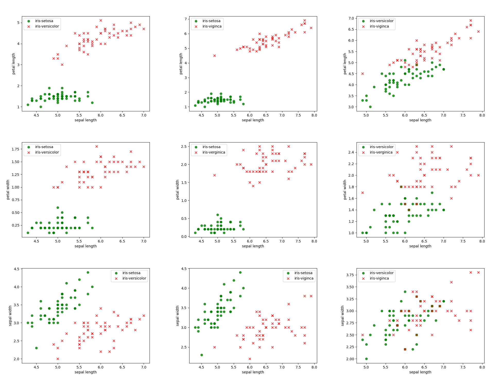
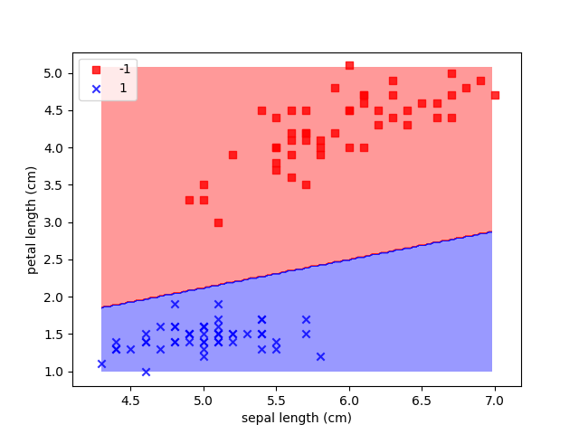
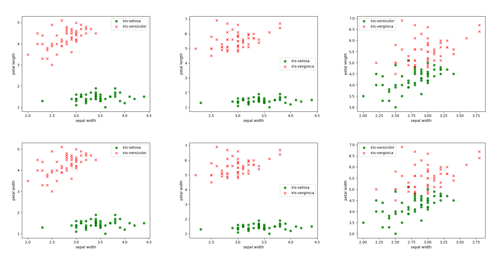
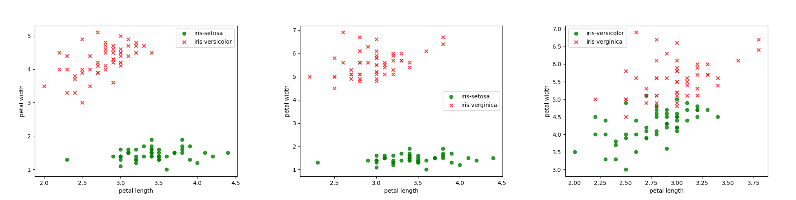

# IRIS DATASET - Perceptron training - FROM SCRATCH.

## Features
- Train on two classes Iris-setosa & Iris-versicolor
- Two features - sepal length & petal length only.

## Installation
```bash
git clone https://github.com/kagehisa4/Neural_Networks/perceptrons
cd iris
python train.py
```
After running installation, the code will train net on two classes - IRIS-SETOSA & IRIS-VERSICOLOR.
To modify the classes- EDIT reader.py to change input/output features. The instructions are also present on the code file using comments.

## IMAGES ARE SHOWN FOR ALL COMBINATIONS ON THE IRIS DATASET.

1. 
      - this shows all combinations of INPUT with the SEPAL-LENGTH feature.
      - the perceptron can be trained only on the LINEAR SEPARABLE features.
      - notice the first image at top-left, we trained our perceptron on this.

2. 
      - this is decision boundary on which perceptron is trained.
      - refer to the code to know how to plot them.

3. 
      - this shows all combinations of INPUT with the SEPAL-WIDTH feature.

4. 
      - this shows all combinations of INPUT with the PETAL-LENGTH feature.
